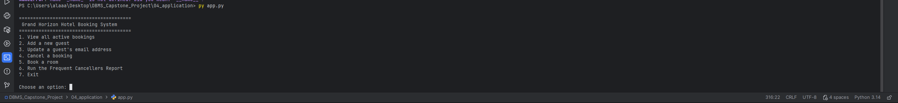
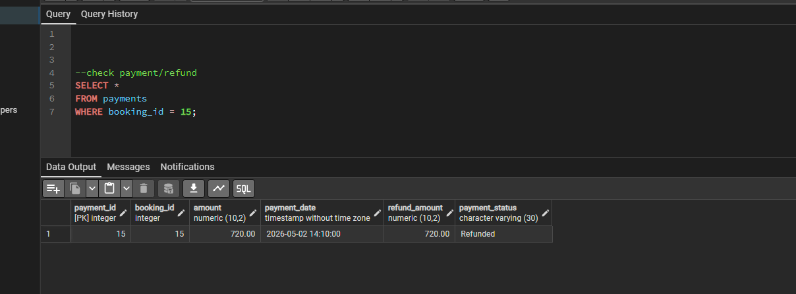
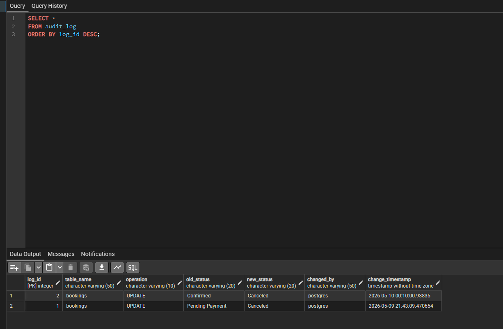

# Project Report: Grand Horizon Hotel Booking System

## Student Information

_Student Name:_ Ala Hussain Fahaid Alsagoor
_Student ID:_ 447300049
_Project Title:_ Grand Horizon Hotel Booking System with Cancellation & Refund Logic  
_Database System:_ PostgreSQL  
_Application Language:_ Python  
_Main Libraries:_ psycopg2, python-dotenv

---

## 1. Project Overview

The Grand Horizon Hotel Booking System is a PostgreSQL-backed database project designed to manage hotel reservations, guests, rooms, employees, payments, refunds, and audit logging.

The system was created for a hotel that needs to move away from spreadsheet-based reservation tracking into a centralized database system. The main purpose of the system is to prevent double-booking, store guest and room information, manage booking payments, apply cancellation refund rules, and track sensitive booking status changes.

The target users of this system are:

- Front desk staff, who create, update, book, and cancel reservations.
- Hotel managers, who need reports about revenue and cancellations.
- System administrators, who need audit logs for sensitive updates.

---

## 2. Business Rules Implemented

The project implements the main business rules required for the hotel system:

### 2.1 Exclusive Room Occupancy

A room cannot be booked by more than one guest during overlapping date ranges. This rule is enforced using a PostgreSQL trigger on the bookings table.

The overlap logic used is:

sql
NEW.check_in < existing.check_out
AND NEW.check_out > existing.check_in

This prevents a room from being reserved if an active booking already exists for the same period.

### 2.2 Cancellation and Refund Policy

The system includes a stored function named calculate_refund.

If a guest cancels fewer than 48 hours before the scheduled check-in date, the refund amount is 50% of the total booking price. If the cancellation happens earlier than 48 hours before check-in, the guest receives a full refund.

### 2.3 Guest Active Booking Limit

A guest cannot hold more than 3 active future reservations at the same time. This rule is checked inside the book_room stored procedure before inserting a new booking.

### 2.4 Historical Pricing

The system stores the room rate at the time of booking in the locked_rate_per_night column. This ensures that if the room type base price changes later, previous bookings keep the original price.

### 2.5 Staff Hierarchy

Employees are stored with a self-referencing manager_id. The General Manager has no manager, while all other employees must report to one manager.

---

## 3. Schema Design Explanation

The database was normalized to reduce redundancy and keep the data organized. The main entities are:

- guests
- room_types
- rooms
- amenities
- room_amenities
- employees
- bookings
- payments
- audit_log

### 3.1 Guests Table

The guests table stores guest personal and contact information such as name, email, phone number, date of birth, and creation timestamp.

The email column is unique to prevent duplicate guest accounts.

### 3.2 Room Types and Rooms

The room_types table stores the general type of room, such as Standard, Deluxe, Suite, Family, and Executive. It also stores the base price and room capacity.

The rooms table stores the actual physical rooms in the hotel, including room number, floor, room type, and room status.

This design separates room categories from individual rooms, which avoids repeating room type data for every room.

### 3.3 Amenities and Room Amenities

The amenities table stores available hotel amenities.

The room_amenities table is a junction table that resolves the many-to-many relationship between rooms and amenities. It uses a composite primary key:

sql
PRIMARY KEY (room_id, amenity_id)

This means one room can have many amenities, and one amenity can belong to many rooms.

### 3.4 Employees Table

The employees table stores employee information and uses manager_id as a self-referencing foreign key. This allows the database to represent the employee reporting hierarchy.

A recursive CTE was used to retrieve an employee’s full management chain up to the General Manager.

### 3.5 Bookings Table

The bookings table is the central table in the system. It connects guests to rooms and stores the booking dates, status, locked room rate, total price, booking timestamp, and cancellation timestamp.

Important constraints include:

sql
CHECK (check_out > check_in)
CHECK (status IN ('Pending Payment', 'Confirmed', 'Canceled', 'Completed'))

### 3.6 Payments Table

The payments table stores payment information for bookings, including payment amount, payment date, refund amount, and payment status.

It is connected to the bookings table through booking_id.

### 3.7 Audit Log Table

The audit_log table stores status changes made to bookings. It is populated automatically by an AFTER UPDATE trigger when the booking status changes.

The audit log table does not use a direct foreign key to bookings because the required table structure stores general audit information such as table name, operation, old status, new status, changed user, and timestamp.

---

## 4. ERD and Relationships

The ERD was created to show the relationships between the database entities.

Main relationships:

| Relationship                | Type                  | Description                                    |
| --------------------------- | --------------------- | ---------------------------------------------- |
| guests to bookings          | One-to-Many           | One guest can have many bookings               |
| rooms to bookings           | One-to-Many           | One room can appear in many bookings over time |
| room_types to rooms         | One-to-Many           | One room type can describe many rooms          |
| rooms to room_amenities     | One-to-Many           | One room can have many amenity links           |
| amenities to room_amenities | One-to-Many           | One amenity can be linked to many rooms        |
| employees to employees      | Recursive One-to-Many | One manager can supervise many employees       |
| bookings to payments        | One-to-Many           | One booking can have payment records           |

_Screenshot:_ Add ERD_diagram.png in the submission folder.

---

## 5. SQL Queries and Reports

The file 02_queries.sql contains the required 10 parameterized queries. These queries support common hotel operations such as retrieving guest information, finding available rooms, listing active bookings, calculating revenue, checking pending payments, and retrieving refund totals.

The project also includes two complex reports:

### 5.1 Revenue by Room Type

This report joins room_types, rooms, bookings, and payments. It calculates total revenue grouped by room type and uses HAVING to display only room types that generated more than $5,000.

### 5.2 Frequent Cancellers

This report identifies guests who canceled more than 2 bookings in the past year. It uses a CTE to isolate canceled bookings within the required time period, then groups by guest to count cancellations.

### 5.3 Recursive CTE

A recursive CTE was created to return the full management chain for a selected employee.

### 5.4 Window Function

A window function query was created to rank guests by lifetime spending using DENSE_RANK().

---

## 6. Stored Procedures, Functions, and Triggers

The file 03_procedures_triggers.sql includes the main business logic.

### 6.1 Refund Function

The calculate_refund function calculates the refund amount based on the cancellation date and booking check-in date.

### 6.2 Booking Procedure

The book_room stored procedure checks:

- Whether the guest exists.
- Whether the room exists and is available.
- Whether the guest already has 3 active future bookings.
- Whether the room is already booked during the requested dates.
- The correct room rate at the time of booking.

If all checks pass, it inserts the booking and returns a success message. If a rule fails, it returns a clear error message.

### 6.3 Overlap Prevention Trigger

The overlap prevention trigger prevents inserting or updating a booking when the selected room already has an active overlapping booking.

### 6.4 Audit Logging Trigger

The audit trigger automatically inserts a row into audit_log whenever a booking status changes. This helps track sensitive changes, especially cancellations.

---

## 7. Python Application Integration

The project includes a terminal-based Python application in the 04_application folder.

The application uses:

- psycopg2 to connect Python with PostgreSQL.
- python-dotenv to read database credentials from a .env file.
- SimpleConnectionPool to manage database connections.
- try...except blocks to handle database errors gracefully.

The application menu includes:

1. View all active bookings.
2. Add a new guest.
3. Update a guest's email address.
4. Cancel a booking.
5. Book a room.
6. Run the Frequent Cancellers Report.
7. Exit.

The real .env file is not included in the submission because it contains private database credentials. Instead, .env.example is included.

---

## 8. Testing Summary

Testing was performed using both SQL scripts and the Python application.

The file 03_test.sql demonstrates:

- A successful booking through the stored procedure.
- A failed booking due to overlapping room dates.
- A failed booking when a guest already has 3 active future bookings.
- A manual booking status update that inserts a row into audit_log.
- Early and late cancellation refund calculations.

The Python application was also tested for:

- Viewing active bookings.
- Adding a new guest.
- Updating a guest email.
- Booking a room.
- Canceling a booking and applying the refund function.
- Running the Frequent Cancellers report.

---

## 9. Performance Optimization

The selected query for optimization was the “Check Available Rooms” query.

Before optimization, EXPLAIN (ANALYZE, BUFFERS) was run on the query. Then a composite index was added:

sql
CREATE INDEX IF NOT EXISTS idx_bookings_room_dates
ON bookings(room_id, check_in, check_out);

After adding the index, the same EXPLAIN ANALYZE query was run again.

The execution time changed from:

text
Before index: 0.159 ms
After index: 0.147 ms

The improvement was small because the sample database contains a small number of rows. PostgreSQL may choose a sequential scan for small tables because it can be cheaper than using an index. However, in a real hotel booking system with a much larger bookings table, the composite index would be more useful for speeding up availability checks.

The full performance details are included in 05_performance.md.

---

## 10. Screenshots

Include screenshots in the Screenshots/ folder.

Suggested screenshots:

1. ERD diagram.
2. Successful execution of 01_schema_and_data.sql.
3. Successful execution of 03_test.sql.
4. Audit log showing booking status change.
5. Python application menu.
6. Python successful booking.
7. Python cancellation showing refund amount.
8. Frequent Cancellers report.

Example screenshot references:

text
Screenshots/python_menu.png
Screenshots/booking_success.png
Screenshots/cancellation_refund.png
Screenshots/audit_log.png

---

## 11. Challenges Faced

One challenge was implementing the overlap prevention logic correctly. The system needed to prevent double-booking only for active bookings, while ignoring canceled or completed bookings.

Another challenge was handling the refund function from the Python application. The function expected specific PostgreSQL data types, so explicit type casting was added in the Python SQL call.

A third challenge was managing database credentials securely. This was solved by using a private .env file locally and submitting only .env.example.

---

## 12. Reflection

This project helped me understand how a real database system combines schema design, constraints, procedures, triggers, indexing, and application integration.

The most important part of the project was learning how business rules can be enforced directly inside the database. For example, the overlap prevention trigger protects the data even if a user tries to insert an invalid booking outside the Python application.

The project also showed the importance of writing clean SQL queries, testing business rules, and documenting performance results. Building the Python application made the database more practical because it allowed users to interact with the system through a simple terminal menu.

Overall, the project demonstrates how PostgreSQL and Python can work together to build a reliable hotel booking system with reservation management, refund logic, reporting, and audit tracking.

---

## 13. Final Deliverables Included

The submission package includes:

text
01_schema_and_data.sql
02_queries.sql
03_procedures_triggers.sql
03_test.sql
04_application/
05_performance.md
Project_Report.md
README.md
ERD_diagram.png
Screenshots/

The real .env file is excluded for security reasons.

Screeshots

